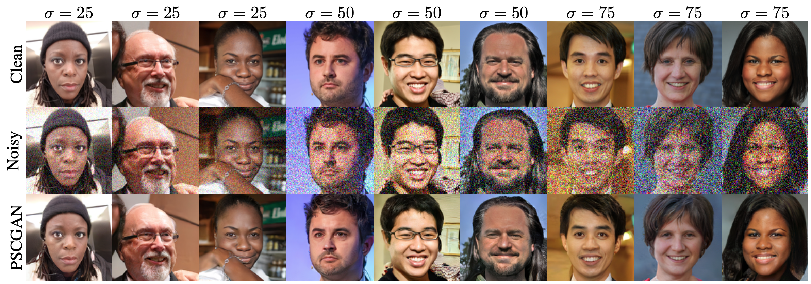
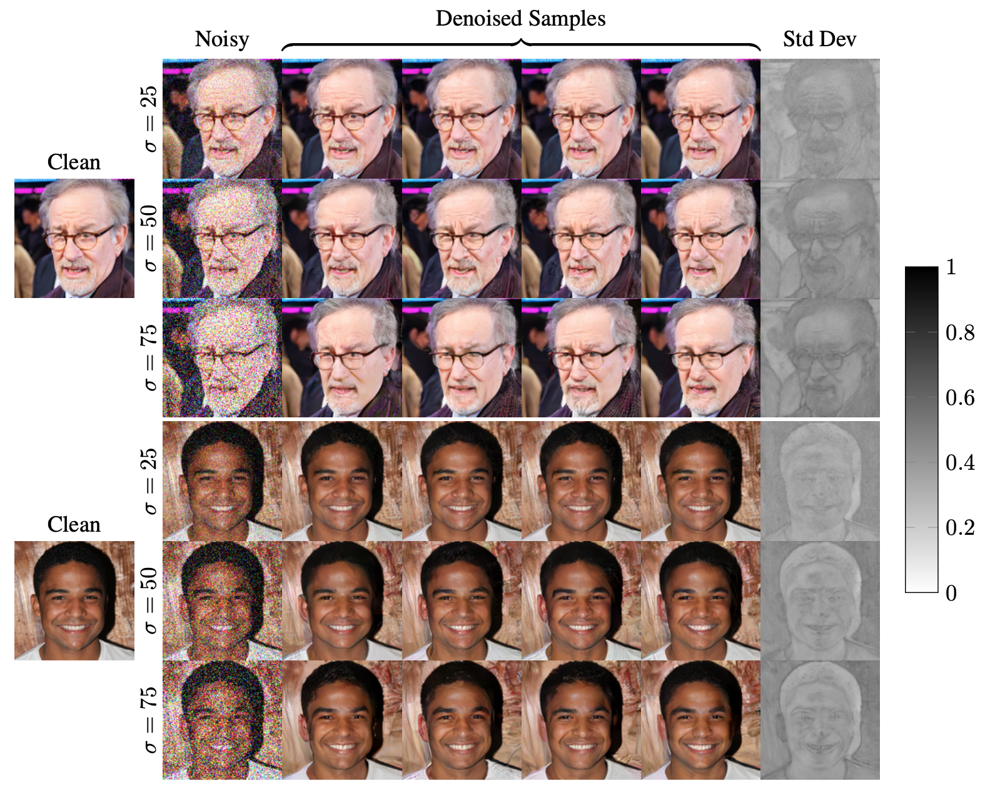

<div align="center">

### High Perceptual Quality Image Denoising with a Posterior Sampling CGAN

#### _Guy Ohayon, Theo Adrai, Gregory Vaksman, Michael Elad, Peyman Milanfar_

</div>

> The vast work in Deep Learning (DL) has led to a leap in image denoising research.
> Most DL solutions for this task have chosen to put their efforts on the denoiser's architecture while maximizing distortion performance.
> However, distortion driven solutions lead to blurry results with sub-optimal perceptual quality, especially in immoderate noise levels.
> In this paper we propose a different perspective, aiming to produce sharp and visually pleasing denoised images that are still faithful to their clean sources.
Formally, our goal is to achieve high perceptual quality with acceptable distortion.
This is attained by a stochastic denoiser that samples from the posterior distribution, trained as a generator in a conditional generative adversarial networks' (CGAN) framework.
> Contrary to distortion-based regularization terms that conflict with perceptual quality, we introduce to the CGAN objective a theoretically founded penalty term that does not force a distortion requirement on individual samples, but rather on their mean.
> We showcase our proposed method with a novel denoiser architecture that achieves the reformed denoising goal and produces vivid and diverse outcomes in immoderate noise levels.

<div align="center">





[](https://arxiv.org/abs/2103.04192) [](https://opensource.org/licenses/MIT)
[](https://www.python.org/downloads/release/python-380/)
[](https://pytorch.org/) [](https://developer.nvidia.com/cuda-10.2-download-archive) [](https://github.com/PyTorchLightning/pytorch-lightning)

</div>

## Table of Contents

- [Getting started](#Getting-started)
  - [Requirements](#Requirements)
  - [Data sets](#Data-sets)
  - [Downloading checkpoints](#Downloading-checkpoints)
- [Running the code](#Running-the-code)
  - [Training](#Training)
  - [Testing](#Testing)
  - [Reproducing our Results](#Reproducing-our-Results)
    - [All at Once](#All-at-Once)
    - [Figures 1 and 2](#Figures-1-and-2)
    - [Table 1](#Table-1)
    - [Figure 4](#Figure-4)
    - [Figures 6 and 7](#Figures-6-and-7)
- [Using PyDrive to Download Checkpoints](#Using-PyDrive-to-Download-Checkpoints)
- [Troubleshooting](#Troubleshooting)
  - [Data sets structure](#Data-sets-structure)
  - [Cuda out of memory](#Cuda-out-of-memory)

## Getting started

### Requirements

[Optional] We recommend using Anaconda3 to create the appropriate environment:

```bash
conda create --name pscgan python=3.8
```

Activate the environment:

```bash
conda activate pscgan
```

Install the requirements:

```bash
pip install -r requirements.txt
```

### Data sets

- FFHQ 128x128: clone the official FFHQ [repository](https://github.com/NVlabs/ffhq-dataset) and download:

    ```bash
    python ffhq/download_ffhq.py --thumbs
    ```

- LSUN Church outdoor and Bedroom: clone the official LSUN [repository](https://github.com/fyu/lsun) and download:

    ```bash
    python lsun/download.py -c church_outdoor
    python lsun/download.py -c bedroom  # Takes time, >3M images
    ```

  After downloading the LSUN data sets, unzip the downloaded files:

    ```bash
    unzip lsun/church_outdoor_train_lmdb.zip -d .
    unzip lsun/bedroom_train_lmdb.zip -d .  # Takes time, >3M images
    ```

For reproducibility, we advise that you split each data set as explained in Appendix C of [our paper
](https://arxiv.org/abs/2103.04192). For your convenience, we provide a script which does just that.
If you are interested in reproducing _all_ of our paper's results at once, you can skip the following steps and go directly to [All at Once](#All-at-Once).

- After downloading the FFHQ dataset, run:

    ```bash
    python preprocess.py --dataset ffhq --data_dir path/to/downloaded/thumbnails128x128 --out_dir destination/path/of/ffhq_preprocessed
    ```

- After downloading and unzipping the LSUN Church outdoor data set (or Bedroom), run:

    ```bash
    python preprocess.py --dataset church --data_dir path/to/unzip/church_outdoor_train_lmdb --out_dir destination/path/of/church_preprocessed
    ```

Feel free to use the `--n_thread` flag to speed-up the process. Consult `python preprocess.py --help` for more details.

### Downloading checkpoints

The checkpoints producing the results presented in [our paper](https://arxiv.org/abs/2103.04192) are available [here](https://drive.google.com/drive/folders/1dcw1799nL5NxX2Zt4MhlAvGMDQ4lYr6I?usp=sharing).
Note that we support the PyDrive API to download from Google Drive.
If you encounter a "quota exceeded" error, or seek an automated way to download the checkpoints, check out [Using PyDrive to Download Checkpoints](#Using-PyDrive-to-Download-Checkpoints).

## Running the code

You need at least one GPU to run our code. Additionally, we support accelerated training and testing on several GPUs,
relying on [PyTorch Lightning](https://github.com/PyTorchLightning/pytorch-lightning).

### Training

We support training of all methods evaluated in the paper (PSCGAN, Ours-LAG, and the MSE methods).
The entrypoint to train a denoising method is the `train.py` script (consult `python train.py --help`).
For instance, the following command will train PSCGAN form scratch to denoise images from the FFHQ data set, with a white Gaussian noise contamination level of sigma=25.

```bash
python train.py --method pscgan --noise_std 25 --train_set path/to/ffhq_preprocessed/train 
```

The `train.py` script loads one of the default configuration files located in the `experiments/` folder, and overrides the necessary hyperparameters based on the arguments you pass to it.

The checkpoints of your experiment will be automatically saved by PyTorch Lightning (every 5 epochs) under `path/to/out_dir/results/lightning_logs`.

### Testing

In our paper we evaluate the performance of PSCGAN on the PSNR and the FID measures, and also analyze its noise reduction properties.
After [dowloading our checkpoints](#Downloading-Checkpoints) or [training](#Training) your own, you can use `test.py` to execute all of our evaluations.
For example, to test the PSNR and FID results of Ours-MSE on the FFHQ test set  with a noise contamination level of 50, run:

```bash
python test.py --method ours_mse --noise_std 50 --fid_and_psnr --checkpoint path/to/checkpoint/ffhq/noise50/ours_mse-50.ckpt --train_set path/to/ffhq_preprocessed/train --test_set path/to/ffhq_preprocessed/test 
```

If you wish to simply denoise an entire noisy folder of images, where all images are contaminated with a white Gaussian noise of sigma=50 for instance, run:

```bash
python test.py --method pscgan --noise_std 0 --save_batch -1 --checkpoint path/to/checkpoint/ffhq/noise50/pscgan-50.ckpt --train_set path/to/ffhq_preprocessed/train --test_set path/to/folder_with_contaminated_images/ 
```

`--noise_std 0` means that the image prepocessor will not add noise to your pictures. You can change 0 to a custom standard deviation of noise that you wish to add.
`--save_batch -1` tells the testing loop to denoise all the pictures in your folder.
Results of such a test will be saved under `experiments/results` (use the `--out_dir` flag to customize the destination path).

### Reproducing our Results

_Desclaimer: For best reproductibility, testing should be done using the provided checkpoints (consult [dowloading our checkpoints](#Downloading-Checkpoints)). If you wish to reproduce our results while training your own checkpoints, you should follow the guidelines in our training details. Finally, note that the scale of the FID results varies greatly with the dataset size. Refer to Appendix C in [our paper](https://arxiv.org/abs/2103.04192) for details about the structure of our training and test sets and training details._

_Note that we use `pytorch_lightning.seed_everything(0)` for reproducibility. However, there [could be](https://pytorch.org/docs/stable/notes/randomness.html) slight deviations from our reported results. If you see a significant deviation, please let us know._

#### All at Once

To reproduce all of our paper's results at once, simply run the `reproduce_all.sh` script. This script finishes within a few hours, depending on your machine, and each figure and table in [our paper](https://arxiv.org/abs/2103.04192) will have its raw results placed in the appropriate directory under `reproduced_all`.
The script also takes care of data preprocessing and checkpoint downloading. Several requirements are needed prior to running the script:

- Download the official datasets as described in [Data sets](#Data-sets) (and unzip the LSUN lmdb files).
- Place `token.pickle` in the same directory of the `reproduce_all.sh` script as described in [Using PyDrive to Download Checkpoints](#Using-PyDrive-to-Download-Checkpoints).
- Set the following environment variables:

    ```bash
    export thumbnails128x128=path/to/downloaded/thumbnails128x128
    export church_outdoor_train_lmdb=path/to/unzip/church_outdoor_train_lmdb
    export bedroom_train_lmdb=path/to/unzip/bedroom_train_lmdb
    export n_gpus=4  # The maximum number of GPUs you can allocate for running the script 
    export divide_expanded_forward_pass=2  # Increase to avoid cuda out of memory
    ```

Finally, run the script:

```bash
./reproduce_all.sh
```

#### Figures 1 and 2

The denoised samples presented in the figures are available in the first denoised batches of the FFHQ test set with indices `0,3,4,5,14,15,23,25,26` and are obtained by running the following, when successively executing all possible combinations of test settings among `METHOD={pscgan, lag, ours_mse, dncnn}` and `NOISE_STD={25,50,75}`:

```bash
python test.py --method METHOD --noise_std NOISE_STD --save_batch 0 3 4 5 14 15 23 25 26 --checkpoint path/to/checkpoint/ffhq/NOISE_STD/METHOD-NOISE_STD.ckpt --test_set path/to/ffhq_preprocessed/test 
```

#### Table 1

The PSNR and FID results of _PSCGAN_ are obtained by running the following, when successively setting all possible test combinations among `DATASET={ffhq, church, bedroom}` and `NOISE_STD={25,50,75}`:

```bash
python test.py --method pscgan --noise_std NOISE_STD --fid_and_psnr --num_fid_evals 32 --sigma_z 1 -N 64 --checkpoint path/to/checkpoint/DATASET/NOISE_STD/pscgan-NOISE_STD.ckpt --train_set path/to/DATASET_preprocessed/train --test_set path/to/DATASET_preprocessed/test
```

The PSNR and FID results of the _MSE methods_ are obtained by running the following, when successively setting all possible test combinations among `DATASET={ffhq, church, bedroom}`, `METHOD={oursMSE, dncnn}` and `NOISE_STD={25,50,75}`:

```bash
python test.py --method METHOD --noise_std NOISE_STD --fid_and_psnr --checkpoint path/to/checkpoint/DATASET/NOISE_STD/METHOD-NOISE_STD.ckpt --train_set path/to/DATASET_preprocessed/train --test_set path/to/DATASET_preprocessed/test
```

#### Figure 3

The results of _PSCGAN_ and _PSCGAN-A_ in the perception-distortion tradeoff traversals reported in Figure 3 are obtained by running the following, when successively setting all possible test combinations among `METHOD={pscgan, lag}` and `NOISE_STD={25,50,75}`:

```bash
python test.py --method METHOD --noise_std NOISE_STD --fid_and_psnr --num_fid_evals 32 --sigma_z 0 0.25 0.5 0.75 1 -N 1 2 4 8 16 32 64 --checkpoint path/to/checkpoint/ffhq/NOISE_STD/METHOD-NOISE_STD.ckpt --train_set path/to/ffhq_preprocessed/train --test_set path/to/ffhq_preprocessed/test
```

The results of the MSE methods in Figure 3 are taken from Table 1.

#### Figure 4

The approximated p.d.fs of the _patch-RMSE_, the _local-noise-RMS_ and the _noise-RMS_ reported in Figure 4, as well as the high confidence level (above 94.6%) in D'agostino and Pearson's normality tests for _PSCGAN_ and _Ours-MSE_, are obtained by running the following for all combinations of `METHOD={pscgan, ours_mse}` and `NOISE_STD={25,50,75}`:

```bash
python test.py --method METHOD --noise_std NOISE_STD --denoiser_criteria --checkpoint path/to/checkpoint/ffhq/NOISE_STD/METHOD-NOISE_STD.ckpt --test_set path/to/ffhq_preprocessed/test
```

#### Figures 6 and 7

The denoised samples presented in Figures 6 and 7 are available in the first denoised batches of the LSUN Bedroom and LSUN Church outdoor test sets with indices `0,1,3,4,6,8,9` and are obtained by running the following, for all possible combinations in `DATASET={bedroom, church}`, `METHOD={pscgan, ours_mse, dncnn}` and `NOISE_STD={25,50,75}`:

```bash
python test.py --method METHOD --noise_std NOISE_STD --save_batch 0 1 3 4 6 8 9 --checkpoint path/to/checkpoint/DATASET/NOISE_STD/METHOD-NOISE_STD.ckpt --test_set path/to/DATASET/test
```

## Using PyDrive to Download Checkpoints

Credit to [royorel](https://github.com/royorel)

Google drive enforces a quota on file downloads by anonymous users.
In order to avoid this issue, you can download our checkpoints by using PyDrive API.

### Step 1: Add our checkpoint folder to the "Shared With Me" section of your Google Drive

Note: this step does *not* count against your Google Drive storage limit.

- Login to your Google Drive.
- Visit [checkpoints](https://drive.google.com/drive/folders/1dcw1799nL5NxX2Zt4MhlAvGMDQ4lYr6I?usp=sharing).

### Step 2: Enable the Google Drive API

Note: this only applies to *your* download script, and does not give access to other users.
Nevertheless, we recommend revoking the script's access after the download is complete.

- Visit [google's pydrive quickstart](https://developers.google.com/drive/api/v3/quickstart/python)
- Click on enable drive API.
- Select Desktop app.
- Download client configuration.
- Place `credentials.json` in the same directory as `download_checkpoint.py`.
- Run `python download_checkpoint.py --init` (must be on a local machine, connected to a display) and follow the link printed by the script.
- Place `token.pickle` in the same directory as `download_checkpoint.py`, on the machine where you will download the checkpoints.

Note: If you have issue with the last two steps, check [Google's Troubleshooting](https://developers.google.com/drive/api/v3/quickstart/python?authuser=3#troubleshooting).

### Step 3: Run download_checkpoint.py

To download all checkpoints at once under the folder `checkpoints`, run:

```bash
python download_checkpoint.py --all --dest checkpoints
```

Alternatively, you can pick individual checkpoints, for instance you can download our PSCGAN checkpoint (trained to denoise face images contaminated with Gaussian noise with sigma=25) to the current directory:

```bash
python download_checkpoint.py --dataset ffhq --noise_std 25 --method pscgan --dest .
```

## Troubleshooting

### Data sets structure

You should pass to `train.py` or to `test.py` data sets conntaining _sub-folders only_. The following error occures when either the train or test set contains files only:

```diff
- RuntimeError: Found 0 files in subfolders of: <dataset dir> Supported extensions are: .jpg,.jpeg,.png,.ppm,.bmp,.pgm,.tif,.tiff,.webp
```

Our implementation loads images by using the [torchvision image folder class](https://pytorch.org/vision/0.8/datasets.html#imagefolder).
You can adapt the structure of your datasets' folders to contain the appropriate subdirectories.
For instance, we used a dummy subdirectory as follows:

    thumbnails128x128
    ├── train
    │   └── dummy
    |       ├── 00000.png
    |       ├── 00001.png
    |       ├── ...
    |       └── 69999.png
    └── test
        └── dummy
            ├── 03000.png
            ├── 03001.png
            ├── ...
            └── 04999.png

You can use `prepare_data.py` for an automated way of reproducing our train and test sets. Check out [Data sets](#Data-sets) for more detail instructions.

### Cuda out of memory

Our method computes the mean of many samples to get an accurate estimate of the posterior expectation (8 samples in training, up to 64 samples in testing).
With a default batch size of 8, the code is very memory demanding. You may encounter a cuda out of memory error:

```diff
- RuntimeError: CUDA out of memory. Tried to allocate ...
```

The easiest option is to allocate more GPUs with the `--n_gpus` flag.
If you don't have more GPUs available:
- During training, you can reduce the batch size with the `--batch_size` flag.
- During testing, you can split each forwarded batch into multiple sub-batches and mitigate memory usage by increasing the `--divide_expanded_forward_pass` flag when testing with `--method pscgan` or `--method lag`.
